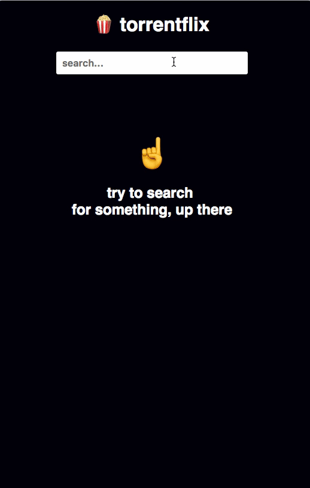

# torrentflix

> Cast torrent files using Google Cast API

  

# What's it

It lets you search for a movie or show using the [OMDb API](http://www.omdbapi.com/), then it try to find torrent files for it using the [Popcorn API](https://popcornofficial.docs.apiary.io/#reference).

Once you select a torrent file, it will let you cast it to a chromecast.

It will try to donwload a subtitle automatically too.

> This is just the frontend code, you will need the [api](https://github.com/schiehll/torrentflix-api) too to make it work.

# How to use it

Once you clone this repo and install it's dependencies, create a `.env` file with `API_URL` (the url where the [api](https://github.com/schiehll/torrentflix-api) is running), then run `yarn build` then `yarn start`. That's it.

# Limitations

## Browsers

Currently it only works in Chrome since it uses the Google Cast API.

## Subtitles

It only cares for `pt-BR` subtitles currently.

# TODO

Make it a PWA?
Add tests
